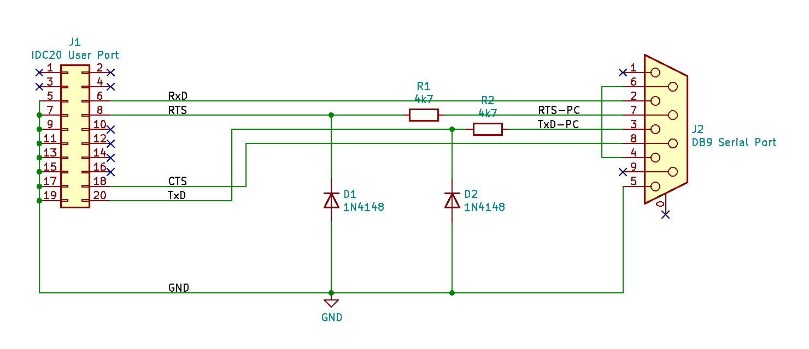

# acorn-upurs-pcb

This project contains the KiCad schematic and PCB design for the
[UPURS](https://www.retro-kit.co.uk/UPURS/) Adapter.

UPURS (by Martin Barr) is perfect for transfering Acorn BBC Micro
floppy discs to a PC. All you need is an adapter cable with 2
resistors and 2 diodes.

Designing a PCB for this simple adapter is absolute overkill, but
it allowed me to gain experience with KiCad Schematic entry and PCB
design.

The adapter board has a 20-pin IDC connector for the BBC Micro user
port, and a 9-pin serial port connector for a USB-to-serial adapter
cable.

The printed circuit board was ordered from JLCPCB (not affiliated).
I use a "UGreen USB to RS-232 DB9 Serial Adapter Cable", based on
the Prolific PL2303 chipset.

## Repository layout

- kicad/ contains the KiCad schematic and PCB design files
- kicad/gerbers/ contains the Gerber files as sent to manufacturing
- docs/ contains screenshots and images

